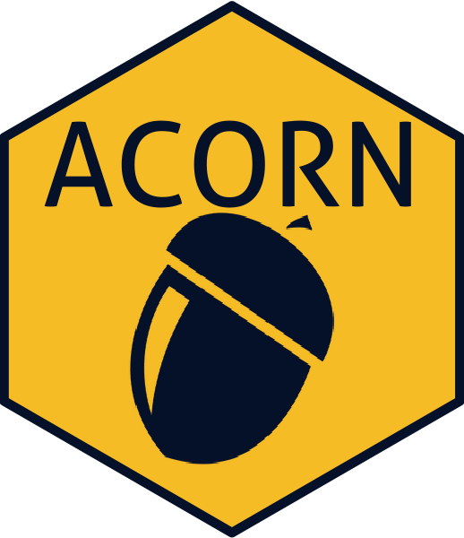

# Overview

A Clinically Oriented antimicrobial Resistance Network (ACORN) is a Wellcome funded project led by the Mahidol-Oxford Tropical Medicine Research Unit and the Oxford University of Oxford Clinical Research Unit.
The major aim of ACORN is to develop and test a comprehensive data capture system for patient-focussed antimicrobial resistance (AMR) surveillance in low- and middle-income countries settings.

Detailed information can be found on [ACORN project website.](https://acornamr.net)

# ACORN Dashboard

The ACORN Dashboard is a tool to connect, visualise and analyse ACORN collected data.

# Installation

**The ACORN dashboard is still in development and should NOT be used for production.**

The app is available in three forms: a web app, a standalone app (Windows OS only), and an R package.

(1) (Windows OS, macOS or Linux) The latest release of the web app can be accessed at https://moru.shinyapps.io/acorn2/.

(2) (Windows OS) A standalone version of the app can be downloaded from [this repository' releases section](https://github.com/acornamr/acorn-dashboard/releases).

(3) (Windows, macOS or Linux) The app can also be run as an R package.

- (Once) install R (4.1.0 or above) your PC 
- (At every new release of the ACORN dashboard) install the package: `remotes::install_github("acornamr/acorn-dashboard", ref = "master")`
- launch the app: `acorn::run_app()`
